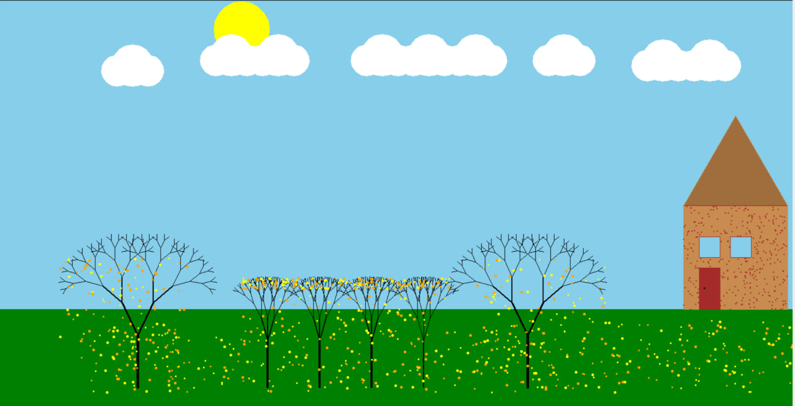

# My first Computer Art Project



``` python 

#خورشید
def sun(x,y):
    turtle.penup()
    turtle.setpos(x,y)
    turtle.pendown()
    turtle.fillcolor("orange")
    turtle.color("yellow")
    turtle.begin_fill()
    turtle.circle(50)
    turtle.end_fill()
sun(-250,340)
turtle.pencolor("black")
#درخت بزرگ 
def tree(l,a,s):
    if l>10:
        turtle.pensize(s)
        turtle.forward(l)
        turtle.left(a)
        tree(l*0.7,a,s*0.6)
        turtle.right(2*a)
        tree(l*0.7,a,s*0.6)
        turtle.left(a)
        turtle.backward(l)
#درخت کوچیک
def tree2(l,a,s):
    if l>10:
        
        turtle.pensize(s)
        turtle.forward(l)
        turtle.left(a)
        tree(l*0.5,a,s*0.6)
        turtle.right(a)
        tree(l*0.5,a,s*0.6)
        turtle.right(a)
        tree(l*0.5,a,s*0.6)
        turtle.left(a)
        turtle.backward(l)


#ابر
def cloud1(x1,y1,a):
    turtle.penup()
    turtle.setpos(x1,y1)
    turtle.pendown()
    turtle.pencolor("white")
    turtle.fillcolor("white")
    for i in range(a):
        turtle.begin_fill() 
        turtle.circle(30)
        turtle.end_fill()
        turtle.penup()
        turtle.forward(30)
        turtle.pendown()
        turtle.begin_fill()
        turtle.circle(40)
        turtle.end_fill()
        turtle.penup()
        turtle.forward(30)
        turtle.pendown()
        turtle.begin_fill()
        turtle.circle(30)
        turtle.end_fill()
        turtle.penup()
        turtle.forward(30)
        turtle.pendown()
        turtle.end_fill()

        
turtle.setpos(-500,-350)
tree(100,25,5)
turtle.setpos(-250,-350)
tree2(90,15,4)
turtle.setpos(-150,-350)
tree2(90,15,4)
turtle.setpos(-50,-350)
tree2(90,15,4)
turtle.setpos(50,-350)
tree2(90,15,2)
turtle.setpos(250,-350)
tree(100,25,5)

turtle.setheading(0)
cloud1(-540,230,1)
cloud1(290,250,1)
cloud1(-350,250,2)
cloud1(-60,250,3)
cloud1(480,240,2)
#برگ درخت
def barg1(x,y):
    turtle.penup()
    turtle.setpos(x,y)
    turtle.pendown()
    turtle.dot(random.choice([4,5]),random.choice(["yellow","orange"]))
for i in range(1000):
    x=random.randint(-700,700)
    y=random.randint(-400,-200)
    barg1(x,y)
#نقطه های خانه
def noghte(x,y):
    turtle.penup()
    turtle.setpos(x,y)
    turtle.pendown()
    turtle.dot(3,"brown")

turtle.colormode(255)
#خانه
def home(l):
    turtle.pencolor(200,140,80)
    turtle.fillcolor(200,140,80)
    turtle.penup()
    turtle.setpos(550,-200)
    turtle.pendown()
    turtle.begin_fill()
    for i in range(4):
        turtle.forward(l)
        turtle.left(90)
    turtle.end_fill()
    turtle.penup()
    turtle.setpos(550,0)
    turtle.pendown()
    turtle.setheading(60)
    turtle.fillcolor(160,110,60)
    turtle.begin_fill()
    turtle.forward(l)
    turtle.right(120)
    turtle.forward(l)
    turtle.end_fill()
home(200)

for i in range(400):
    x=random.randint(550,750)
    y=random.randint(-200,0)
    noghte(x,y)


```

